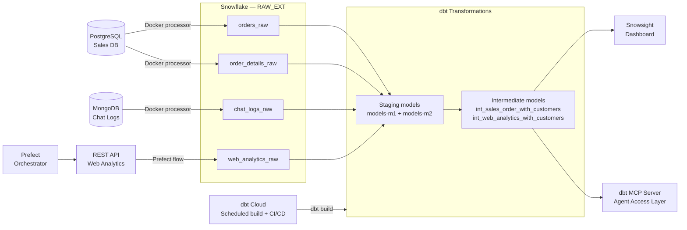

# Adventure Works Data Platform

A full-stack data engineering platform that ingests from three source systems, transforms through a cloud data warehouse, enforces data quality automatically, and exposes models to AI agents via MCP.

## Architecture



**Caption:** Data flows from three source systems through Snowflake raw tables, is transformed by dbt through staging and intermediate layers, validated by automated tests in dbt Cloud, visualized in Snowsight, and exposed to AI agents via a dbt MCP server.

---

## Problem Statement

Adventure Works operates across three separate systems — a PostgreSQL sales database, a MongoDB chat log store, and a web analytics REST API — with no unified view of customer behavior. Analysts could see what customers bought but not how they browsed, and business stakeholders had no real-time visibility into sales trends or which regions were driving revenue. This platform unifies all three sources into a single Snowflake data warehouse, applies automated data quality testing, and serves the results through both a Snowsight dashboard and an AI agent access layer built on the Model Context Protocol.

---

## Tech Stack

| Layer | Technology | Why |
|-------|-----------|-----|
| Source Systems | PostgreSQL, MongoDB, REST API | Represents real-world heterogeneity — relational, document, and API-based sources each require a different extraction strategy |
| Extraction | Python ETL Processor | A custom processor allows fine-grained control over watermark logic, stage management, and retry behavior that a generic tool wouldn't provide |
| Warehouse | Snowflake | Separation of compute and storage prevents idle costs; native VARIANT support handles MongoDB's semi-structured JSON without preprocessing |
| Transformation | dbt | Built-in testing, auto-generated documentation, lineage tracking, and version control make it the standard for modern analytics engineering |
| Orchestration | Prefect | Simple `@task` and `@flow` decorators with built-in retry and logging made it faster to implement than Airflow for this scale |
| CI/CD | dbt Cloud + GitHub | Automated scheduled builds and PR-triggered test runs catch regressions before they reach production |
| Agent Access | dbt MCP Server | Exposes compiled SQL, model metadata, column descriptions, and lineage to any MCP-compatible AI agent programmatically |
| Containerization | Docker Compose | Ensures every service — processor, Prefect, MCP server — runs identically regardless of local environment |

---

## Data Flow

**Ingestion:** The Python ETL processor runs on a configurable interval inside Docker, connecting to PostgreSQL and MongoDB using a watermark strategy — it derives the high watermark from the max timestamp in the data itself rather than the system clock, ensuring consistent comparisons across sources. Extracted data is uploaded to Snowflake internal stages as CSV and JSON files, then loaded into raw tables in the `RAW_EXT` schema via `COPY INTO`. Staged files are only removed after a successful load, preserving them for retry if a load fails. Web analytics data follows a parallel path: a Prefect flow polls the clickstream REST API on a schedule, cleans and deduplicates the response, and loads it into `web_analytics_raw` using the same stage-and-copy pattern.

**Transformation:** dbt processes raw data through three layers. Base models select from raw sources and apply initial type casting — notably, `base_real_time__sales_orders` reconstructs nested order detail arrays from flat rows using `ARRAY_AGG(OBJECT_CONSTRUCT(...))` to match the VARIANT schema of the legacy ecom orders. Staging models clean and standardize data, with `stg_ecom__sales_orders` unioning legacy and real-time orders into a single model. Intermediate models join across sources: `int_sales_order_with_customers` denormalizes sales orders with customer attributes for dashboard consumption, and `int_web_analytics_with_customers` enriches clickstream events with customer geography and demographics for behavioral analysis.

**Serving:** The intermediate models feed a Snowsight dashboard showing sales volume and revenue by country over the last 30 days. They are also exposed via a dbt MCP server running in Docker, which allows AI agents to discover models, read column descriptions, compile SQL, and trace lineage programmatically. dbt Cloud runs `dbt build` on a daily schedule and on every pull request, enforcing all 28 data tests automatically before any change reaches production.

---

## Setup and Run

### Prerequisites
- Docker Desktop
- Snowflake account (trial works)
- Python 3.12
- uv (`pip install uv`)
- dbt Cloud account (free tier)

### Quick Start

```bash
# 1. Clone the repository
git clone https://github.com/byu-is-566/is-566-11-final-project-carhorne.git
cd is-566-11-final-project-carhorne

# 2. Configure environment
cp .env.sample .env
# Edit .env with your Snowflake, PostgreSQL, and MongoDB credentials

# 3. Create Snowflake objects
# Run sql/create_raw_tables.sql and prefect/snowflake_objects.sql in a Snowflake worksheet

# 4. Start all services
docker compose up -d

# 5. Run dbt models and tests
cd dbt
set -a; source ../.env; set +a
uv run dbt build

# 6. Start the MCP server
docker compose up --build dbt-mcp

# 7. (Optional) Run the MCP demo client
cd mcp
uv sync
uv run python demo_client.py
```

### Environment Variables

| Variable | Description |
|----------|-------------|
| `SNOWFLAKE_ACCOUNT` | Full Snowflake account identifier |
| `SNOWFLAKE_USER` | Snowflake username |
| `SNOWFLAKE_PASSWORD` | Snowflake password |
| `SNOWFLAKE_WAREHOUSE` | Compute warehouse name |
| `SNOWFLAKE_DATABASE` | Target database |
| `SNOWFLAKE_ROLE` | Snowflake role |
| `API_BASE_URL` | Web analytics API base URL |
| `PREFECT_API_URL` | Prefect server URL (inside Docker: `http://prefect-server:4200/api`) |
| `FLOW_SCHEDULE_MINUTES` | How often the Prefect flow runs |

See `.env.sample` for the full list.

---

## Project Milestones

### Milestone 1: Core Pipeline
Built a containerized Python ETL processor that extracts from PostgreSQL (sales orders, order details) and MongoDB (chat logs) using a watermark strategy, stages data in Snowflake internal stages, and loads it via COPY INTO. Created 14 dbt models across base, staging, and intermediate layers including `stg_ecom__sales_orders` (which unions legacy and real-time orders), `stg_real_time__chat_logs`, and `int_sales_order_with_customers`. Built a Snowsight dashboard showing 30-day sales trends by country powered directly by the intermediate layer.

### Milestone 2: Orchestration, Quality, and Agent-Assisted Development
Added a Prefect 2.0 flow that ingests web analytics clickstream data from a REST API on a configurable schedule with incremental watermark logic. Integrated web analytics into dbt with `stg_web_analytics` and `int_web_analytics_with_customers`. Added 28 data quality tests including `not_null`, `accepted_values`, `relationships`, source freshness checks (warn at 12h, error at 24h), and two custom SQL tests. Set up dbt Cloud with a daily scheduled build and PR-triggered CI job. Achieved 48/48 passing tests in the production environment.

### Milestone 3: Agent Access and Portfolio
Deployed a dbt MCP server in Docker Compose that exposes all 18 dbt models to AI agents via Server-Sent Events. Upgraded all model and column descriptions to be agent-friendly — explicit grain statements, join targets, and business context on every column. Built and ran a Python MCP demo client demonstrating tool discovery, model listing, model detail retrieval, SQL compilation, and lineage tracing across the full project.

---

## Key Metrics

| Metric | Value |
|--------|-------|
| Records per Cycle | 3000 |
| Pipeline Execution time | 12.9 seconds |
| dbt models | 21 |
| dbt tests | 31 |
| Test pass rate | 48/48 |
| Data sources integrated | 5 |
| Models exposed via MCP | 18 |

---

## What I Learned

The biggest surprise was how much documentation quality matters once agents are in the picture. I had always treated model descriptions as nice-to-have, but seeing the MCP demo client return exactly what I wrote in the YAML — and knowing that's the only context an agent has — made it feel like a first-class deliverable for the first time. I also learned that watermark strategy details matter more than they seem: deriving the high watermark from the data rather than the system clock sounds like a small decision but it's the difference between a reliable pipeline and one that silently misses records. If I were starting over, I'd write agent-friendly documentation from day one instead of retrofitting it at the end — the two things turn out to be the same standard of quality.

---

## Future Improvements

- **Streaming ingestion**: Replace the interval-based processor with a Kafka or Snowpipe streaming approach to reduce pipeline latency from minutes to seconds for the sales order data
- **Agent query interface**: Build a Slack bot or web UI that lets business users ask natural language questions answered by an agent using the MCP server — closing the loop from data platform to self-service analytics
- **Data vault modeling**: Refactor the intermediate layer into a data vault pattern (hubs, links, satellites) to better handle schema changes as new source systems are added

---

## Technical Decisions

Key architectural decisions and the reasoning behind them:

- **Watermark from data, not system clock** — ensures consistent timestamp comparisons along a single source timeline, preventing missed or duplicate records across processor cycles
- **Stage cleanup on success only** — staged files are preserved if COPY INTO fails, enabling automatic retry on the next cycle without data loss or manual intervention  
- **`ARRAY_AGG(OBJECT_CONSTRUCT(...))` for schema alignment** — reconstructs nested JSON arrays from flat relational rows so real-time order data integrates with the existing VARIANT-based ecom schema without modifying downstream models
- **`NULLIF(..., 'NaN')` for pandas null handling** — pandas writes NaN as a string in CSV exports; this converts them to proper SQL nulls before numeric casting
- **Docker for the MCP server** — running the MCP server in Docker Compose rather than locally ensures it uses the same credentials and network as the rest of the stack, and starts/stops with the rest of the services